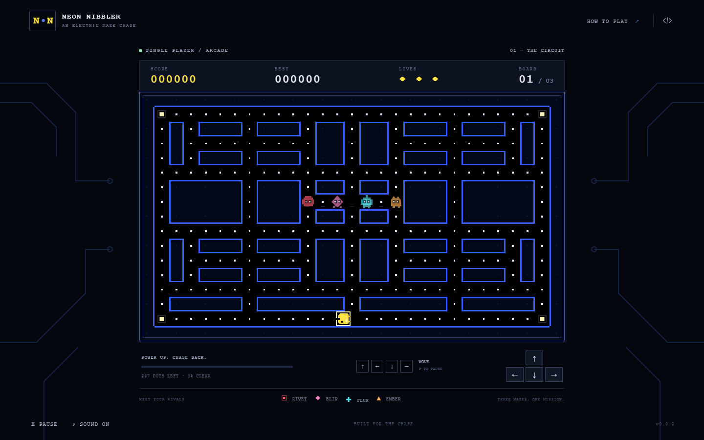

# Neon Nibbler

Eat the dots. Outsmart the rivals. Turn the chase around.

An original single-player arcade maze chase, built with **Babylon Lite and WebGPU**. Three authored landscape mazes, four rival personalities, responsive buffered movement, and keyboard or touch controls.

<a href="project-name/documentation/screenshot01.png"></a>

## Play

Neon Nibbler v0.0.3 is live on GitHub Pages. Play in a WebGPU-capable browser with keyboard or touch controls.

[Play Neon Nibbler](https://samuelasherrivello.github.io/babylon-lite-pacman-maze-chase-clone/)

Requires a WebGPU-capable browser and graphics device. Chrome/Edge with hardware acceleration is the verified browser path. Unsupported devices receive an explanation and retry action.

Collect all dots to clear **The Circuit**, **Switchyard**, and **After Hours**. Start with three lives. Corner power pellets give six seconds to catch frightened rivals. The last two seconds change their appearance to warn that the chase will turn again.

| Action | Keyboard | Touch / pointer |
| --- | --- | --- |
| Move | Arrows or WASD | Directional pad |
| Start / replay | Enter | Start / replay button |
| Pause / resume | P or Escape | Pause / resume button |
| Mute | Focus and activate Sound | Sound button |
| Instructions | How to Play | How to Play |

Standard dots score 10; power pellets score 50. Consecutive captures score 200, 400, 800, then 1,600. Another power pellet refreshes the timer and resets the capture multiplier. A lost life preserves score and collected dots, resets actors, and gives brief visible protection. Clear all three boards to win. Best score saves locally when storage is available.

**Rivet** pursues, **Blip** intercepts, **Flux** patrols, and **Ember** alternates between roaming and chasing. Captured rivals return home before rejoining. Focus loss pauses play; resume explicitly when ready.

## Run locally

Node.js 24 is used by CI (minimum supported Node.js 22.12).

```sh
npm ci
npm run dev
```

Open the Vite URL ending in `/babylon-lite-pacman-maze-chase-clone/`.

```sh
npm test              # deterministic game rules and complete maze traversal
npm run build        # production assets under project-name/dist/
npm run preview      # preview the production build
npx playwright install chromium
npm run test:browser  # full Chromium WebGPU, controls, states, mobile layouts
npm run check        # rule tests + production build
```

Stop the dev server before repeating `npm ci` on Windows so Vite's native dependency is not locked.

## Verification

- 18 simulation tests cover connected mazes, legal spawns, buffered turns, reversal, frame-rate independence, scoring, power refresh, escape behavior, slower frightened movement, swept collisions, respawn, pause, failure, restart, and all three boards.
- Seven browser tests cover actual keyboard/pointer controls, emulated touch, pause/focus loss, audio activation/mute, best-score persistence, unavailable storage, WebGPU recovery, controlled transitions, full path traversal, and replay.
- Inspected layouts: 1440×900 desktop, 390×844 portrait mobile, and 844×390 landscape mobile. The landscape phone layout places HUD and controls beside the maze.
- Full progression tests use a controlled fixture with pursuing enemies held at home to isolate legal maze traversal. Enemy behavior and collisions are verified separately.
- Physical mobile hardware and perceived speaker/audio quality are unverified. Audio activation/mute and touch emulation are verified in Chromium.

See [source and asset provenance](project-name/documentation/provenance.md). Documentation images are screenshots of the actual game.

## Architecture

The npm project remains at the repository root; `project-name/` is the application root required by the template guidance.

- `src/mazes.js`: three authored corridor layouts, connectivity checks, and shortest-path distances.
- `src/game.js`: pure 120 Hz fixed-step simulation, actors, input buffering, scoring, and state transitions.
- `src/renderer.js`: original pixel artwork on a dynamic texture rendered by Babylon Lite's orthographic sprite renderer.
- `src/main.js`: DOM HUD, keyboard/pointer input, persistence, pause, and initialization recovery.
- `src/audio.js`: original Web Audio cues.
- `test/`: meaningful simulation and browser tests. Development-only test controls are excluded from production.

## Release and deployment

`version.txt` is the sole version source. The checked-in **Release** workflow runs a clean installation, rule checks and build, increments the patch version, commits and tags it, and publishes a GitHub release. **Deploy live demo** builds and publishes `project-name/dist/` to GitHub Pages using the repository subpath. A release bot commit may require explicitly dispatching deployment for the released revision.

```sh
gh workflow run release.yml --ref main
gh workflow run deploy-pages.yml --ref main
```

Verify the release workflow, tag, deployment, and displayed game version after dispatch. OpenSpec change `add-neon-nibbler` tracks acceptance, implementation, validation, and delivery; accepted specifications are synced before archival.

## Original AI Prompt

<details>
<summary>Read the submitted game brief and follow-up</summary>

```markdown
$ai-skills-create-game

Build a polished, complete browser arcade game from this brief. Make reasonable implementation decisions without additional intake questions. Prioritize responsive movement, fair enemy behavior, clear visuals, and a reliable gameplay loop.

## Game identity
- Working title: Pacman Maze Chase
- Public title: Choose an original arcade-style name.
- Type: Single-player maze chase
- Camera: Fixed top-down orthographic view; show the entire maze.
- Platform: Desktop and mobile web browsers
- Session length: Approximately 3–8 minutes

## Project approach
Inspect the existing repository and follow its instructions, engine, architecture, and scripts. Reuse suitable systems and assets. Keep the implementation focused on the game described here.

## Core loop
Start a board → navigate corridors → collect pellets → evade enemies → use power pellets to reverse the chase → clear the board → advance.

Deliver three original, authored maze layouts with increasing difficulty and a victory screen after the third board.

## Player movement
- Use four-direction grid movement with smooth travel between tile centers.
- Arrow keys and WASD control movement; mobile uses a comfortable on-screen directional pad.
- Buffer the latest requested direction until the next valid turn.
- Allow immediate reversal within a corridor.
- Continue moving in the current direction until blocked or redirected.
- Prevent diagonal movement, wall clipping, missed intersections, and speed changes caused by frame rate.
- Keep movement responsive; avoid input delays and excessive easing.

## Rules and scoring
Use these as initial tuning values:
- Three starting lives
- Standard pellet: 10 points
- Power pellet: 50 points
- Power duration: 6 seconds
- Consecutive enemy captures during one power period: 200, 400, 800, then 1,600 points

Each collectible awards points once. Collecting another power pellet refreshes the duration and resets the capture multiplier.

A dangerous enemy collision costs exactly one life. Preserve score and collected pellets, reset actors to safe starting positions, and show a brief ready countdown followed by one second of visible respawn protection.

Detect collisions during movement, including actors crossing or exchanging tiles. When the final collectible and a dangerous collision occur in the same simulation step, prioritize board completion.

## Enemies
Create four enemies distinguished by color, original silhouette details, and behavior:
- Red pursuer: Targets the player’s current position.
- Pink interceptor: Targets walkable tiles ahead of the player.
- Cyan patroller: Visits defined regions and pursues nearby players.
- Orange wanderer: Alternates between roaming and short pursuits.

Enemies navigate legal corridors and choose directions at intersections. Use staggered starting releases and avoid unavoidable opening collisions.

During a power period, enemies become visibly frightened, move more slowly, and favor escape routes. Captured enemies return to their starting area and re-enter play after a short delay. Warn the player during the final two seconds of the power period using a restrained visual cue.

Increase challenge across boards through modest enemy speed and release-timing changes. Keep every board fair and completable.

## Maze design
- Use original layouts with a balanced, approximately symmetrical arcade composition.
- Include loops, multiple escape routes, readable intersections, and four strategically placed power pellets per board.
- Ensure every collectible is reachable from the player’s starting position.
- Keep spawn areas and any enemy-only routes clearly defined.
- Validate layouts for disconnected corridors, trapped actors, and inaccessible collectibles.

## Visual direction
- Black background with crisp neon-blue maze outlines
- White standard pellets and gently pulsing power pellets
- Saturated yellow player with an original design, readable facing direction, and a simple two-frame mouth animation
- Red, pink, cyan, and orange enemies with identifying details beyond color
- Pixel-inspired shapes, sharp edges, and flat colors; avoid gradients and realistic textures
- High-contrast HUD and balanced cabinet-style framing
- Brief arcade transitions and restrained effects that preserve visibility
- Responsive scaling that keeps the complete maze and controls visible without overlap or cropping

## Interface and audio
Include title, ready, playing, paused, board-clear, game-over, and victory states.

Display score, best score, lives, and board number. Save the best score locally when storage is available, with a graceful fallback.

Provide:
- Enter or a visible button to start and restart
- Escape or P to pause and resume
- Visible pause and mute controls
- Original short sounds for collection, power activation, enemy capture, life loss, and board completion

Start audio after user interaction. Pause automatically when the browser loses focus. Freeze gameplay timers while paused, clear stale movement input on resume, and prevent gameplay keys from scrolling the page.

## Inspiration and originality
References:
- https://www.pacman.com/
- https://en.wikipedia.org/wiki/Pac-Man
- Optional screenshots: [Attach reference screenshots here.]

Use references for genre conventions, pacing, contrast, and readability. Create original names, artwork, sounds, maze layouts, and interface details. Avoid copying existing logos, character artwork, audio, or recognizable maze layouts.

## Verification and delivery
Implement and verify the complete experience:
- Starting, moving, turning, reversing, and pausing
- Collecting pellets and refreshing power effects
- All four enemy behaviors, capture, return, and release
- Life loss, respawn protection, and game over
- Clearing all three boards and reaching victory
- Restarting with fully reset gameplay state
- Mobile controls, responsive layout, mute, and best-score persistence

Use the repository’s appropriate checks and browser verification. Fix discovered issues before finishing. Provide concise launch instructions and accurately report what was verified and any remaining limitations.
```
**User follow-up:**

```text
use landscape view for the game
```

</details>

The supplied skill name `ai-skills-create-game` is now `rmc-game-creator`. The original submitted brief is preserved above; implementation choices are documented separately.

## Credits

Original game code, maze layouts, artwork, and synthesized audio created for this project. [PAC-MAN](https://www.pacman.com/) and [the genre reference](https://en.wikipedia.org/wiki/Pac-Man) informed pacing and readability. No copied maze, character artwork, or sound recordings.

Based on [Samuel Asher Rivello's repository template](https://github.com/SamuelAsherRivello/github-repository-template) and [AI Skills Library](https://github.com/SamuelAsherRivello/ai-skills-library). See [LICENSE](LICENSE).


